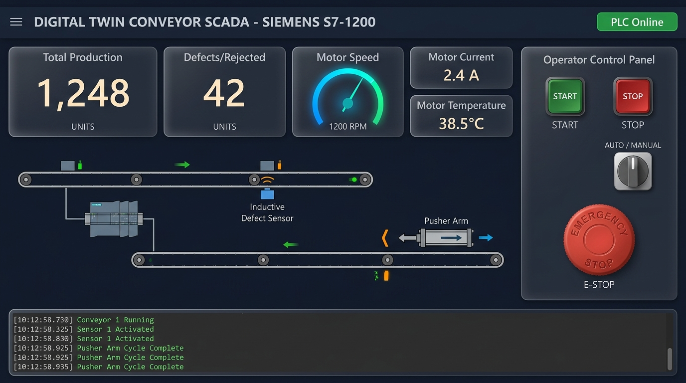
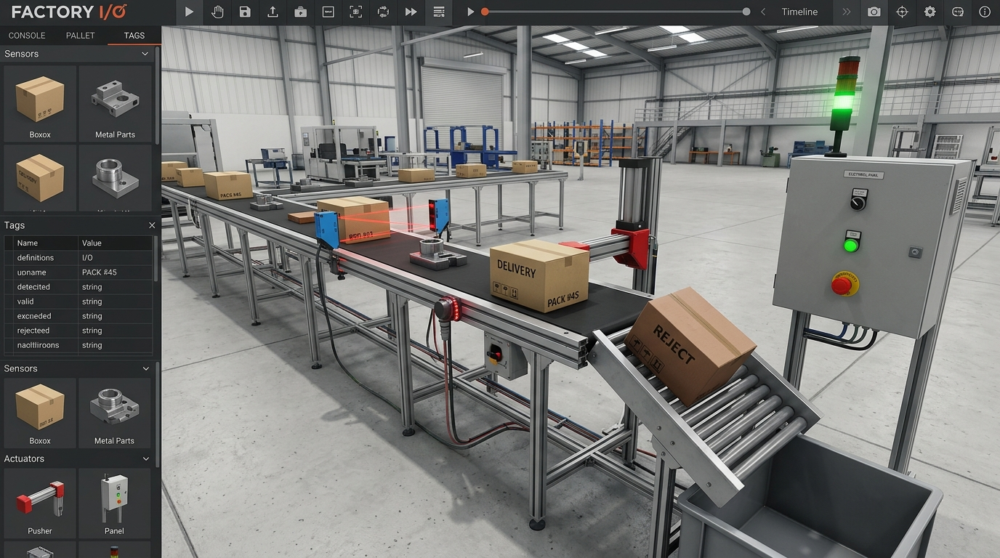
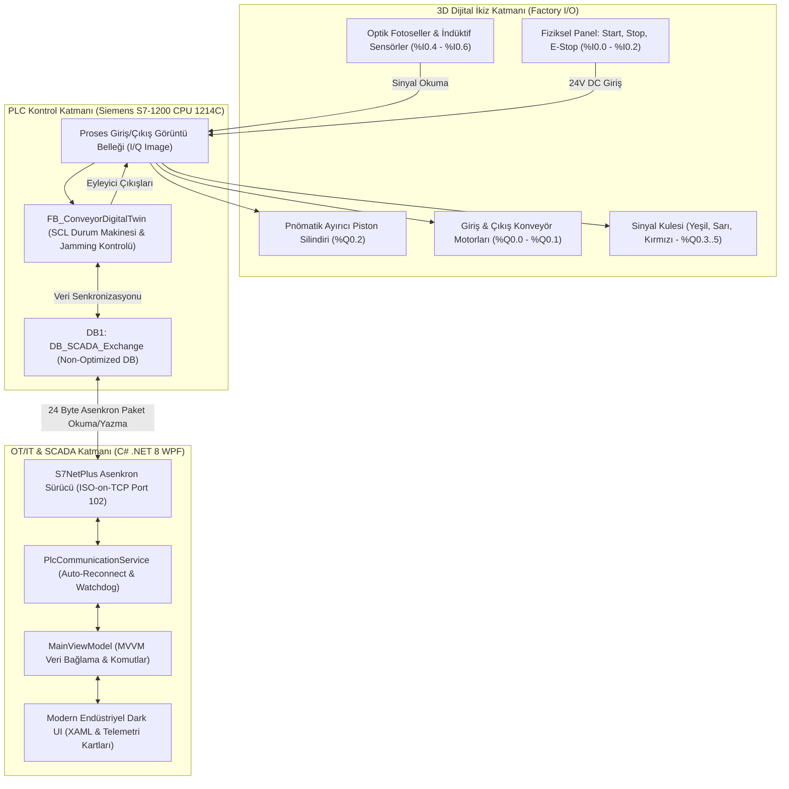

# 🏭 3D Dijital İkiz Tabanlı Endüstriyel Ayırma Konveyörü & C# .NET 8 WPF SCADA
### Siemens SIMATIC S7-1200 ⟷ Factory I/O (3D Twin) ⟷ C# WPF SCADA (MVVM & S7NetPlus)

[](https://support.industry.siemens.com)
[](https://factoryio.com)
[](https://dotnet.microsoft.com)
[](https://github.com/S7NetPlus/s7netplus)
[](https://myk.gov.tr)
[](LICENSE)

---

## 📌 Proje Genel Bakışı & Endüstriyel Çözüm

Bu proje; modern **Endüstri 4.0** ve **OT/IT Entegrasyonu** standartlarında geliştirilmiş, donanım devreye alma maliyetlerini sıfıra indiren bir **3D Dijital İkiz (Digital Twin)** ve **Özel C# SCADA** sistemidir.

Geleneksel otomasyon projelerinde yaşanan donanım bekleme süreleri, kablolama hataları ve saha riskleri; **Factory I/O** 3D simülasyon ortamında fiziksel model oluşturularak, **Siemens S7-1200 (PLCSIM)** üzerinde IEC 61131-3 SCL durum makineleri koşturularak ve **C# .NET 8 WPF** ile modern bir SCADA paneli geliştirilerek sanal ortamda %100 test edilmiş ve devreye alınmıştır.

```text
[3D Factory I/O Sahnesi] ◄──(S7-PLCSIM)──► [Siemens S7-1200 PLC] ◄──(S7 Protocol / Port 102)──► [C# WPF SCADA Panel]
```

---

## 🎥 Canlı Demo ve Sistem Ekran Görüntüleri

| SCADA Operatör Dashboard & Canlı Telemetri | Factory I/O 3D Dijital İkiz Simülasyonu |
| :---: | :---: |
|  |  |

> *(Not: Depoya kendi test kayıtlarınıza ait `demo.gif` veya ekran görüntülerini `docs/images/` klasörüne ekleyebilirsiniz.)*

---

## 📐 Sistem ve Veri Akış Mimarisi (Mermaid)



---

## 🗂️ PLC I/O & Non-Optimized Memory DB Offset Haritası

Siemens TIA Portal'da `DB1 (DB_SCADA_Exchange)` için **Optimized Block Access KAPALI** tutulmuş olup mutlak byte ofsetleri aşağıdadır:

### 1. SCADA Kontrol Komutları (Byte 0) & Durum Geri Bildirimleri (Byte 1)
| Adres / Offset | Veri Tipi | Sembol / Değişken | Yön | Açıklama |
| :--- | :--- | :--- | :--- | :--- |
| `DB1.DBX0.0` | `BOOL` | `scada_cmdStart` | C# -> PLC | Konveyör Başlat Komutu |
| `DB1.DBX0.1` | `BOOL` | `scada_cmdStop` | C# -> PLC | Konveyör Durdur Komutu |
| `DB1.DBX0.2` | `BOOL` | `scada_cmdResetAlarm`| C# -> PLC | Alarm Sıfırlama |
| `DB1.DBX0.3` | `BOOL` | `scada_cmdEStop` | C# -> PLC | Yazılımsal Acil Durdurma |
| `DB1.DBX0.4` | `BOOL` | `scada_cmdManualPusher`| C# -> PLC | Manuel Ayırıcı Piston İtme |
| `DB1.DBX0.5` | `BOOL` | `scada_cmdAutoMode` | C# -> PLC | Otomatik / Manuel Mod |
| `DB1.DBX0.6` | `BOOL` | `scada_cmdClearCount`| C# -> PLC | Sayaçları Sıfırla |
| `DB1.DBX0.7` | `BOOL` | `scada_watchdogIn` | C# -> PLC | SCADA Kalp Atışı (Heartbeat Toggle) |
| `DB1.DBX1.0` | `BOOL` | `plc_statusRunning` | PLC -> C# | Sistem Çalışıyor Geri Bildirimi |
| `DB1.DBX1.1` | `BOOL` | `plc_statusStopped` | PLC -> C# | Sistem Durdu Geri Bildirimi |
| `DB1.DBX1.2` | `BOOL` | `plc_statusAlarm` | PLC -> C# | Genel Arıza Bayrağı |
| `DB1.DBX1.3` | `BOOL` | `plc_statusEStopActive`| PLC -> C# | E-Stop Kilitli Durumu |
| `DB1.DBX1.4` | `BOOL` | `plc_statusSensorEntry`| PLC -> C# | Giriş Fotoseli Parça Algıladı |
| `DB1.DBX1.5` | `BOOL` | `plc_statusSensorExit` | PLC -> C# | Çıkış Fotoseli Parça Saydı |
| `DB1.DBX1.6` | `BOOL` | `plc_statusPusherExtended`| PLC -> C# | Ayırıcı Piston İleride Sensörü |
| `DB1.DBX1.7` | `BOOL` | `plc_watchdogEcho` | PLC -> C# | PLC Watchdog Eko Cevabı |

### 2. Telemetri, Hız ve Sayaç Verileri (Byte 2 - Byte 23)
| Adres / Offset | Veri Tipi | Sembol / Değişken | C# Veri Tipi | Açıklama |
| :--- | :--- | :--- | :--- | :--- |
| `DB1.DBW2` | `INT` | `scada_setSpeedRpm` | `short` | Hedef Hız Set Değeri (0 - 1500 RPM) |
| `DB1.DBW4` | `INT` | `plc_actualSpeedRpm`| `short` | Gerçek Motor Hızı Geri Beslemesi |
| `DB1.DBD6` | `DINT` | `plc_pieceCountTotal`| `int` | Toplam Geçen Sağlam Ürün Sayısı |
| `DB1.DBD10` | `DINT` | `plc_pieceCountRejected`| `int` | Hatalı / Ayrılan Ürün Sayısı |
| `DB1.DBD14` | `REAL` | `plc_motorCurrentAmp`| `float` | Motor Anlık Akımı (A) |
| `DB1.DBD18` | `REAL` | `plc_motorTemperature`| `float` | Motor Sıcaklığı (°C) |
| `DB1.DBW22` | `INT` | `plc_alarmCode` | `short` | Hata Kodu (0: Normal, 1: E-Stop, 2: Termik, 3: Jam, 4: WDog) |

---

## 🛡️ Hata Yönetimi, Alarmlar ve Saha Güvenliği

Sistem endüstriyel güvenlik yönetmeliklerine (ISO 13849-1 ve IEC 62061) uygun olarak şu arıza senaryolarına karşı kilitlenmiştir:

1. **Acil Durdurma (E-Stop):** Fiziksel paneldeki `%I0.2` butonu veya SCADA'daki `cmdEStop` tetiklendiğinde durum makinesi anında `State 99 (Safe Stop)` moduna geçer. Tüm kontaktörler düşürülür, kırmızı sinyal flaşörü ve sesli alarm başlar. Buton açılmadan ve Reset verilmeden sistem yeniden başlatılamaz.
2. **Kablo Kopması & Watchdog Heartbeat:** SCADA her 500ms'de bir toggle biti gönderir. PLC'deki SCL bloğu 3 saniye boyunca sinyal alamazsa haberleşmenin kesildiğini tespit ederek motorları durdurur (`Hata Kodu: 4`).
3. **Konveyörde Ürün Tıkanması (Jamming):** Giriş fotoseli 4 saniyeden uzun süre kesintisiz kapalı kalırsa bant otomatik olarak durdurulur (`Hata Kodu: 3`).
4. **C# Auto-Reconnect:** PLC bağlantısı kesilirse SCADA arayüzü donmaz; arka planda her 3 saniyede bir otomatik olarak yeniden bağlanma dener ve operatöre canlı log düşer.

---

## 💡 Teknik Mülakatta Bu Proje Nasıl Savunulur?

> - **Neden Non-Optimized DB?**  
>   *"C# S7NetPlus kütüphanesi doğrudan ISO-on-TCP (RFC 1006) üzerinden mutlak byte ofsetlerine eriştiği için DB1'de Optimized Block Access'i kapattım. Böylece 24 byte'lık paketi <5ms içinde tek seferde okuyabiliyorum."*
>
> - **SCADA Arayüzünün Donmasını Nasıl Engellediniz?**  
>   *"PLC haberleşmesini UI thread üzerinde değil, `PlcCommunicationService` içinde `Task.Run` ve `async/await` ile arka plan worker'ında yürüttüm. Verileri UI'a `Dispatcher.Invoke` ile aktardım."*
>
> - **Dijital İkizin Gerçek Sahaya Uyarlanması:**  
>   *"PLC kodum tamamen IEC 61131-3 SCL standardındadır. Sahaya çıkıldığında tek yapılması gereken TIA Portal'da gerçek S7-1200 CPU 1214C donanımına programı yüklemek ve C# SCADA'ya panonun IP adresini girmektir."*

---

## 🚀 Kurulum ve Çalıştırma Adımları

### 1. PLC Tarafı (Siemens TIA Portal V17/V18/V19):
1. Yeni bir S7-1200 CPU 1214C DC/DC/DC projesi oluşturun.
2. `plc/DB_SCADA_Exchange.scl` ve `plc/FB_ConveyorDigitalTwin.scl` dosyalarını **External Source Files** olarak projeye ekleyin ve derleyin.
3. OB1 içinde `FB_ConveyorDigitalTwin` bloğunu çağırın ve `PLCSIM` simülasyonunu başlatın.

### 2. Factory I/O Tarafı:
1. Factory I/O uygulamasını açın ve `factory_io/FactoryIO_Scene_Mapping.md` dosyasındaki şemaya göre konveyör, sensör ve operatör panelini yerleştirin.
2. **File -> Drivers** menüsünden **Siemens S7-PLCSIM** seçip `Connect` butonuna basın.

### 3. C# WPF SCADA Arayüzü:
1. `scada_wpf/DigitalTwinScada.csproj` dosyasını Visual Studio 2022 ile açın.
2. `F5` tuşuna basarak projeyi derleyin ve çalıştırın.
3. PLC IP adresini (`192.168.0.1` veya yerel PLCSIM IP'niz) girerek **Bağlan** butonuna tıklayın.

---

## 👨‍💻 Geliştirici & İletişim

**Ferhat Mustafa Çalışır**  
*Endüstriyel Otomasyon, PLC & SCADA Yazılım Uzmanı | MYK Seviye 5 Otomasyon Sistemleri Programcısı Adayı*  
📍 Ankara, Türkiye  
🔗 **GitHub:** [FerhatMustafa-automation](https://github.com/FerhatMustafa-automation)  
💼 **LinkedIn:** [Ferhat Mustafa Çalışır](https://www.linkedin.com/in/ferhat-mustafa-%C3%A7al%C4%B1%C5%9F%C4%B1r-787077390/)
